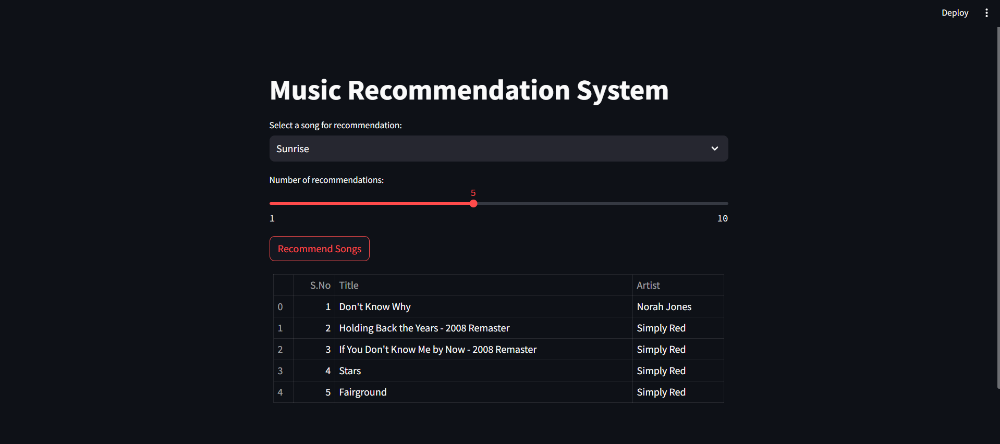

# Music Recommendation System

This project implements a music recommendation system using Streamlit, leveraging a Spotify dataset to suggest similar songs based on user input. The system calculates song similarities using cosine similarity and provides recommendations in real-time.



## Project Overview

The recommendation system uses the Spotify dataset to build a user-item matrix and compute item similarities. Users can select a song from the provided list, and the system will recommend similar songs based on the selected song's popularity and attributes.

## Files

- `Spotify-2000.csv`: The dataset used for the recommendation system.
- `app.py`: The main Streamlit application file that implements the recommendation system.
- `Music_Recommendation_System.ipynb`: A Jupyter notebook version of the same recommendation system code.

## Requirements

To run this project, you need to have the following Python libraries installed:

- `streamlit`
- `pandas`
- `numpy`
- `scikit-learn`
- `scipy`

You can install the required libraries using pip:

```bash
pip install streamlit pandas numpy scikit-learn scipy
